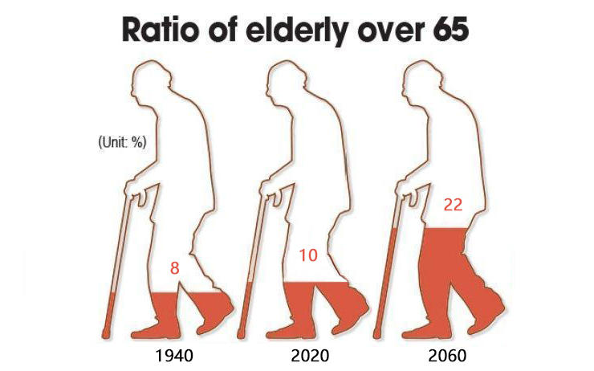
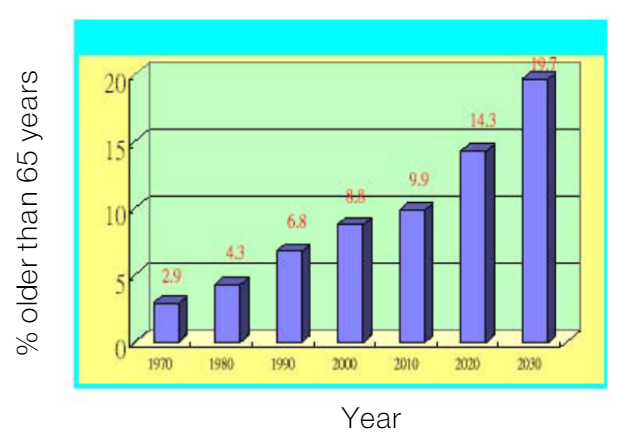
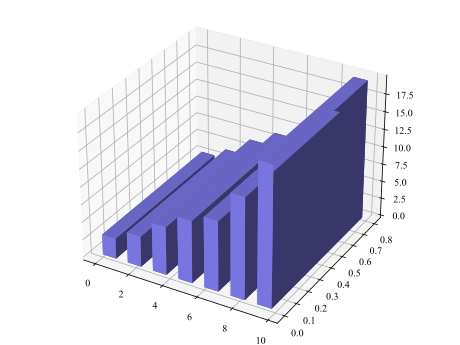
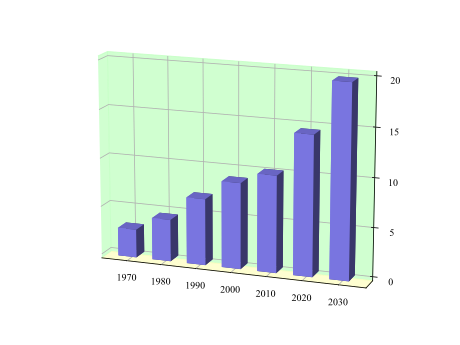
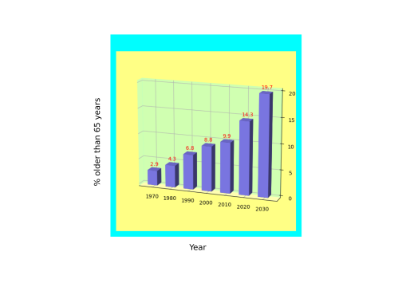
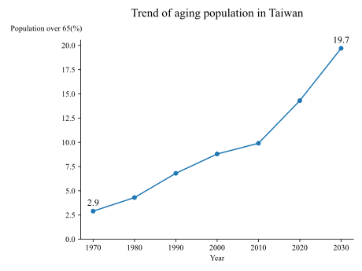

# How to clearly and effectively visualize Taiwan's aging?

> 23 Oct 2022 - Xinran Li, Zihan Zhang, Jiayue Li, Yanfei Lin

*This article talks about an information visualization about **Taiwan's aging problem** in a conference journal. It takes Taiwan as an example to specifically study the impact of aging on society. This visualization has been shared publicly in academic communications, but it designed unreasonably from the perspective of human cognitive theory, visual effects and color. So in this article, we plot based on the same data in another form of graph to improve it. Our improved graph is much simpler, which makes it clear to readers. In this article, we also have publicly contributed the code of the original image and the improved image for better reference. The improved graph nicely explains the aging situation in Taiwan from 1970 to 2020, and it forecasts that in 2030, which shows that the proportion of the elderly population will increase significantly, and tells us the phenomenon cannot be underestimated.*

Are you concerned about the aging of society? According to relevant professional articles and forecast data, **almost every country will experience population aging**—a trend that is both pronounced and historically unprecedented. Over the past six decades, countries of the world had experienced only a slight increase in the share of people aged 60 years and older, from 8% to 10%. But in the next four decades, this group is expected to rise to **22% of the total population**—a jump from 800 million to 2 billion people. Population aging is a silent revolution unprecedented in human history, enough to influence or change the future. On the face of it, the causes of population aging are relatively simple: falling birth rates and rising longevity. However, influenced by the objective factors of social development, the formation background of population aging in different countries or regions has certain differences. The process of population aging is affected not only by the general factors of population transition but also by some birth policies. 

No doubt, we are all living longer—because of better health-care, less smoking, use of seat belts, etc. However, there will be many new challenges to face. **Population aging poses challenges for countries’ economies, and the health of older populations is of concern.** Older people have greater health and long-term care needs than younger people, leading to increased expenditure. They are also less likely to work if they are unhealthy, and could impose an economic burden on families and society. Like everyone else, older people need both physical and economic security, but the burden of providing these securities will be falling on a smaller portion of the population. Pension systems will be stressed and will need reassessment along with retirement policies. Therefore, **aging really has a great impact on a society.** The phenomenon of the aging society cannot be underestimated.

While focusing on the aging of society, our team collected a lot of data to verify this phenomenon, and took Taiwan as an example to specifically study the impact of aging on society. Taiwan is one of the fastest aging countries in the world. In 1993, the percentage of elderly people in Taiwan surpassed the 7 % threshold for classification as an aging country. In 2012, this percentage reached 11.2 %. It’s projected that by 2025 it will be more than 20 %; and according to the expert forecast analysis, by 2043, **one-third of Taiwan’s population will be elderly!**

At the same time, we found an information visualization about **Taiwan's aging problem in a conference journal**. This conference paper is included in ieee xplore. You can access it through the following link:

- [ The Journal on Information Technology in Healthcare](https://www.researchgate.net/publication/4169352_Mobile_hospital_healthcare_for_anybody_in_anytime_and_anywhere)

You can directly turn to page 112 in the paper to see the visualization's details. (For convenience, I put the original graph below.)

It introduces the **aging trend of Taiwan's population**. It is a three-dimensional bar chart. The x-axis represents the time (taking every ten years from 1970 to 2030 as a term of the bar chart). The y-axis is the proportion of people older than 65 years old. We can see that in 1970, the elderly over 65 only accounted for 2.9% of the total population, but the data generally showed an obvious upward trend over time. It is estimated that the proportion will increase to nearly 20% by 2030. What an amazing figure!

This visualization has been shared publicly in academic communications, but it **designed unreasonably** from the perspective of human cognitive theory, visual effects and color. So in this article, we want to make some improvements to it, so as to help people to have more impressive cognitive data. 

There are five colors included in the graph, blue, yellow, green, purple and red. The color saturation is very high. It has three dimensions which takes away unnecessary attention from the reader. Grain texture is a background with straight lines. The x label and y label are very big, which affects the aesthetics. I think the bar chart is good to show numerical comparisons between categories. One axis represents the classification dimension to be compared, and the other axis represents the corresponding value. For time series, we think it is better to use a line chart to represent the trend of an event. So we will consider converting it into a line graph in the next step.

But the original graph is very **difficult to reproduce**, this is a **challenge** for us. Why do we say so? Because our team failed after the first attempt for the following reasons:

1. The matplotlib library in python implements a limited number of APIs. It can make a planar bar chart or a three-dimensional bar chart, but **with matplotlib, the bottom surface of the 3D bar graph must have the same number of data items in the plane** where the x-axis and y-axis are located. The original graph are three-dimensional, while the semantics of the graph is actually two-dimensional. When we tried to use matplotlib to draw 3D images in python, we found that we could only draw the bottom of a square shape, which made us lose our way. We even felt that python could not draw such images.
2. **The bottom color and the back color in 3D box is not consistent.** The bottom color of the box outer frame in the original picture is yellow, and the back color is green.
3. It is very difficult to **stack the outer border**, because there is usually no outer border option in the parameters for drawing images.
4. Use matplotlib to draw a 3D model which is rendered from the perspective of the eyes, so how do we **angle the window so that the image is visible to the reader in the right direction**, which is difficult.

We spent a long time studying how to draw this image. The effort pays off, and we finally get the right idea to solve the problem:

First of all, consider the bar chart. In the matplotlib library, there is no style that can directly draw three-dimensional bars in two dimensions. Therefore, it is necessary to **consider using the bar3d function** in matplotlib library to draw images on the 3D canvas. In the 3D canvas, the x, y, z axes appear. To **present the bar graph on the Oxz plane**, we can arrange the three-dimensional bars on the x axis. At the same time, because the 3D canvas adaptively adjusts the scale spacing of the x, y, z axes, which means that the projection of the overall image on the Oxy plane is close to a square at the beginning, so we **adjusted the scale interval proportion** in our code. 

In addition, in order to better conform to the original image, we adjusted the color of the axis plane, background color, axis scale label, etc. The bottom color of the box outer frame in the original picture should be yellow, and the back color should be green. So we use **"set_pane_color"** and **"patch.set_facecolor"** to make it. And 3D model which is rendered from the perspective of the eyes, so we **set the top view angle to 15 degrees, and set the image rotation to 270 degrees**.

In order to draw the blue outline, first we need to get the image tensor of the image drawn by matplotlib (a tensor of n * m * 3). Matplotlib itself is difficult to complete this kind of conversion. So we need to save the image first, read it using the standard **library PIL (Pillow)**, and finally convert it to ndarray using numpy. We extracted the RGB code of the background color, and then the corresponding **color tensor** can be constructed. The solid color tensor and image tensor are combined up, down, left and right to achieve the purpose of increasing the frame. Similar to drawing a blue outline, first construct a pure white tensor and merge it with the image. Then we need to use the imshow function of matplotlib to display the image on the canvas. Then use the text function to complete the drawing of the axis label.

The following is our final graph to replicate the original one:

From the **cognitive theory**: What is a “Good” Diagram? A diagram is a sentence in a graphical language. The primary purpose of any language is to communicate. Therefore a “good” diagram is one which communicates effectively. Communication (or cognitive) effectiveness is measured by the speed, ease and accuracy with which the information content can be understood. Also, what looks good is not always what communicates most effectively. The most important concepts should be emphasized (highlighted) to get the reader's attention, while less important or contextual elements should be attenuated (weakened). From our course taught by Prof. Cruz, I understand that context outside the graph give reader **extraneous cognitive load**, so we need to make germane load to make reader comfortable. In addition, we should use a legend only when space is tight. **Cognitive tunneling** may naturally happen when looking at a visual element in the graph. lf that happens, the user will not lose relevant information as long as the labels are close. lf the user goes back and forth to the legend, it will have to process other elements in the graph which may overload the **working memory**.

So we use matplotlib to improve the image.

**Avoid using 3D effects.** For the display of two-dimensional data, we'd better not to use three-dimensional images, they simply add pixels to the image without revealing any new pattern of the data, which will add a lot of useless information and make no sense. So we turn the 3D image to the plan. In this way, the reader can read the data more clearly, without meaningless shadows. A plan is intuitive and simple to reveal the meaning of the data.

**Visualizations ought to be self-explanatory.** In the original graph, there is no title. We should have a clear title, it is half-way to having an  easy-to-read figure. Moreover, all axis should be carefully labeled and presented with the respective units of measurement.

**Use visual variables (color, shape, shade) only for data variation.** The data ink-ratio of the original picture is very small while many colors are used. Purple shadows are used for the column, light yellow background color is used for the bottom of the three-dimensional space, green is used for the back and side of the three-dimensional space, and yellow borders are wrapped around the outside of the three-dimensional map. Finally, a layer of blue borders is added outside. These are unnecessary operations, which not only attract readers' attention in other places, but also cause images to be messy and not concise due to too much color matching. So we make the improved graph simple and readable, avoiding using these useless colors or shades.

**Use line plots when variables are time series.** Line plots connect data points sequentially and show the trend between those data points. We can see an obvious nearly linear change trend, which is very intuitive. We think that data that changes over time can be displayed in this way.

**Increase the data-ink ratio.** Every bit of ink requires a reason. Nearly always, that reason should be to present new information. In every visualization we must make sure that we are presenting the data and its message. It will not attract readers' attention to other useless places. In this way, we intuitively displays data, which is very concise. Those without information should not be displayed. But do not blindly increase the data-int ratio, the value should be increased appropriately.

**Direct representation of data at the corresponding location in the map.** The data is directly represented in the corresponding position in the graph,  so that the reader will not waste energy and time to find the approximate position of the data, they can see the accurate value at a glance from the graph.

The data used by our team are completely consistent with those in the paper, but our graph more clearly illustrates the change trend of the data, without messy background colors, clearly and intuitively reveal the increasing aging phenomenon of Taiwan's population, which has sounded an alarm for Taiwan and the world's people. Aging is becoming a world problem. We should timely find out, pay attention to, and provide corresponding services for the elderly.

But we don't need to worry too much about the aging problem, because we have many measures to improve it. To **address the set of interlocked challenges due to the aging society** that we faces, a vision of inclusive and sustainable growth that pays particular attention to the elderly should be set forth. First of all, it is necessary to improve the understanding of the importance of optimizing the birth policy and steadily promote the gradual retirement policy. The second is to tap the labor potential, optimize the labor allocation, and improve the overall labor quality, which will better serve the economic restructuring and continuous promotion in the global value chain; It is necessary to pay attention to the role of technological innovation in dealing with the problem of population aging, and solve the elderly care services pragmatically. At the same time, we must implement the corresponding social policies and legal systems, we can propose a new health care system for the aging economy, so that the aging population becomes a development opportunity.

*We read through our paper as soon as it is drafted, when our writing is fresh in our mind, we will catch typing errors and enable refinement of both the language and the argument, while also allowing us to ensure that all formatting guidelines provided by the article to which we will be submitting our article have been followed. Also, we shared our article with our professor, Dr. Cruz to provide helpful guidance. We use the feedback we received as objectively as possible, revisions, sometimes of a significant kind, to improve the paper. We tried to complete all our revisions and polish all aspects of our article well before we plan to submit it. Finally we return to our documents on a day when we have enough time to read through everything carefully at one sitting and check it again.*

## Wrap-up

That’s all, thank you for your focus! In the article, we talked about an information visualization about Taiwan's aging problem in a conference journal. This visualization has been shared publicly in academic communications, but it was designed unreasonably from the perspective of human cognitive theory, visual effects and color. Based on the knowledge we learned in the class taught by our professor, [Luís Cruz](https://github.com/luiscruz), we have come to many useful conclusions in making visualizations. For example, we'd better to turn a three-dimensional diagram into a plan. Also, we would try to use line plots when variables are time series. In addition, increasing the data-ink ratio is very important. We'd better to direct represent data at the corresponding location in the map. Using visual variables (color, shape, shade) only for data variation is a good way to focus the reader's attention.  

Our improved graph is much simpler, which makes it clear to readers. The improved graph nicely explains the aging situation in Taiwan from 1970 to 2020, and it forecasts that in 2030, which shows that the proportion of the elderly population will increase significantly. We can see from that to conclude that aging really has a great impact on a society, and the problem of aging is not to be underestimated. Also we set a vision of inclusive and sustainable growth that pays particular attention to  the elderly.

